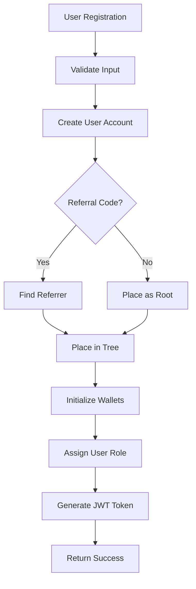
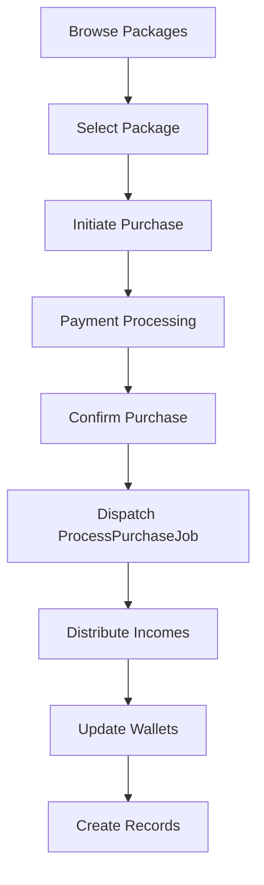

# Complete MLM System Documentation

## 🎯 **System Overview**

This is a complete, production-ready MLM (Multi-Level Marketing) system built with Laravel that includes:

- **User Authentication** with JWT tokens
- **Package Management** for MLM products
- **User Tree Placement** with spillover logic
- **Income Distribution** (Level, Fasttrack, Company allocation)
- **Purchase Processing** with payment integration
- **Comprehensive API** for frontend integration

---

## 🏗️ **System Architecture**

### **Core Components**

1. **Authentication System**
   - JWT-based authentication
   - Role-based access control (Admin/User)
   - Token revocation and session management

2. **User Management**
   - User registration with referral codes
   - Automatic tree placement
   - User profile management

3. **Package System**
   - Product packages with pricing
   - Purchase initiation and confirmation
   - Payment gateway integration

4. **Income Distribution**
   - Level Income (fixed amount per upline)
   - Fasttrack Income (percentage to immediate upline)
   - Company Allocation (percentage to company)

5. **Tree Management**
   - Binary tree structure (4 children per parent)
   - Spillover logic for full nodes
   - Automatic placement algorithms

---

## 📊 **Database Schema**

### **Core Tables**

#### `users`
```sql
id, uuid, name, email, phone, password, referral_code, referred_by, 
parent_id, position, package_id, role_hint, status, metadata, 
last_login_ip, last_login_at, created_at, updated_at, deleted_at
```

#### `user_tree`
```sql
id, user_id, parent_id, position, path, depth, created_at, updated_at
```

#### `packages`
```sql
id, code, name, price, level_number, is_active, description, 
created_at, updated_at
```

#### `user_packages`
```sql
id, user_id, package_id, amount_paid, payment_reference, 
payment_status, purchase_at, assigned_level, payment_meta, 
idempotency_key, processing, processed_at, created_at, updated_at, deleted_at
```

#### `income_configs`
```sql
id, income_type, package_id, name, percentage, is_active, 
metadata, created_at, updated_at, deleted_at
```

#### `wallets`
```sql
id, user_id, wallet_type, currency, balance, pending_balance, 
created_at, updated_at, deleted_at
```

#### `ledger_transactions`
```sql
id, uuid, user_from, user_to, wallet_from_id, wallet_to_id, 
type, amount, currency, reference_id, description, created_at
```

#### `income_records`
```sql
id, user_id, origin_user_id, user_package_id, income_config_id, 
income_type, amount, currency, status, ledger_transaction_id, reference_id, created_at
```

#### `club_entries`
```sql
id, user_id, sponsor_id, level, status, created_at, updated_at
```

---

## 🔄 **Complete User Flow**

### **1. User Registration**



**API Endpoint**: `POST /api/register`

**Request**:
```json
{
  "name": "John Doe",
  "email": "john@example.com",
  "password": "password123",
  "phone": "1234567890",
  "referral_code": "U123ABC"
}
```

**Response**:
```json
{
  "status": "success",
  "message": "User registered successfully",
  "data": {
    "user": { ... },
    "access_token": "jwt_token_here",
    "token_type": "bearer",
    "expires_in": 3600
  }
}
```

### **2. Tree Placement Logic**

The `PlacementService` handles user placement with the following logic:

1. **Direct Placement**: If referrer has < 4 children, place directly
2. **Spillover**: If referrer is full, use BFS to find next available slot
3. **Root Placement**: If no referrer, place as root node
4. **Wallet Initialization**: Ensures all necessary wallets are created

**Key Features**:
- **Spillover Logic**: Automatic placement when parent is full
- **Path Tracking**: Maintains tree structure with paths
- **Position Management**: Tracks child positions (1-4)
- **Depth Calculation**: Automatic depth calculation
- **Wallet Provisioning**: Creates all wallet types (commission, fasttrack, autopool, club, main)

### **3. Package Purchase Flow**



**API Endpoints**:
- `GET /api/packages` - List available packages
- `POST /api/user/packages` - Initiate purchase
- `POST /api/user/packages/confirm` - Confirm purchase
- `GET /api/user/packages` - List user purchases

### **4. Business Validations**

The system enforces critical business rules to maintain MLM integrity:

#### **Referrer Package Validation**
- **Rule**: Upline must have an active package before children can register
- **Implementation**: Checked during registration process
- **Error**: "Referrer must have an active package before you can register under them"
- **Purpose**: Ensures only active participants can build downlines

#### **Sequential Package Purchase**
- **Rule**: Users must purchase packages in sequence (1 → 2 → 3, etc.)
- **Implementation**: Validated before purchase initiation
- **Error**: "You must purchase Package X next. You cannot skip levels"
- **Purpose**: Enforces proper progression through MLM levels

#### **Child Placement Limit**
- **Rule**: Maximum 4 children per parent (binary tree structure)
- **Implementation**: BFS spillover logic in PlacementService
- **Purpose**: Maintains balanced tree structure

### **5. Income Distribution**

The `ProcessPurchaseJob` handles three types of income:

#### **Level Income**
- **Amount**: Fixed amount per upline level
- **Recipients**: All ancestors in placement tree
- **Wallet**: Commission wallet
- **Configuration**: `income_configs.metadata.fixed_amount`

#### **Fasttrack Income**
- **Amount**: Percentage of purchase amount
- **Recipients**: Immediate upline (or company if no upline)
- **Wallet**: Fasttrack wallet
- **Configuration**: `income_configs.percentage`

#### **Company Allocation**
- **Amount**: Percentage of purchase amount
- **Recipients**: Company
- **Wallet**: Company total wallet
- **Configuration**: `income_configs.metadata.company_share`

#### **Club Income**
- **Amount**: Fixed amount per level (configurable)
- **Recipients**: Sponsor in club tree
- **Wallet**: Club wallet
- **Structure**: 10-level deep tree with 4 children per level
- **Configuration**: `income_configs` with `income_type = 'club'` and `level = n`

---

## 🛠️ **API Documentation**

### **Authentication Endpoints**

#### Register User
```http
POST /api/register
Content-Type: application/json

{
  "name": "John Doe",
  "email": "john@example.com",
  "password": "password123",
  "phone": "1234567890",
  "referral_code": "U123ABC"
}
```

#### Login User
```http
POST /api/login
Content-Type: application/json

{
  "email": "john@example.com",
  "password": "password123"
}
```

#### Get User Profile
```http
GET /api/me
Authorization: Bearer <jwt_token>
```

#### Logout User
```http
POST /api/logout
Authorization: Bearer <jwt_token>
```

### **Package Endpoints**

#### List Packages
```http
GET /api/packages?min_price=50&max_price=500&per_page=10
```

#### View Package
```http
GET /api/packages/{id}
```

#### Initiate Purchase
```http
POST /api/user/packages
Authorization: Bearer <jwt_token>
Content-Type: application/json

{
  "package_id": 1,
  "amount": 100.00,
  "payment_gateway": "razorpay",
  "idempotency_key": "unique-key-123",
  "meta": {"device": "mobile"}
}
```

#### Confirm Purchase
```http
POST /api/user/packages/confirm
Authorization: Bearer <jwt_token>
Content-Type: application/json

{
  "idempotency_key": "unique-key-123",
  "payment_reference": "txn_123",
  "payment_status": "completed",
  "gateway": "razorpay",
  "gateway_meta": {"fees": "2.50"}
}
```

#### List User Packages
```http
GET /api/user/packages
Authorization: Bearer <jwt_token>
```

---

## 🔧 **Configuration**

### **Income Configuration**

#### Level Income
```php
IncomeConfig::create([
    'income_type' => 'level',
    'name' => 'Level Income',
    'is_active' => true,
    'metadata' => [
        'fixed_amount' => 0.5, // 0.5 per level
        'description' => 'Fixed amount per upline level'
    ]
]);
```

#### Fasttrack Income
```php
IncomeConfig::create([
    'income_type' => 'fasttrack',
    'package_id' => 1, // Optional: package-specific
    'name' => 'Fasttrack 10%',
    'percentage' => 10, // 10%
    'is_active' => true,
    'metadata' => ['description' => '10% to immediate upline']
]);
```

#### Company Allocation
```php
IncomeConfig::create([
    'income_type' => 'fasttrack',
    'name' => 'Company Allocation',
    'percentage' => 5,
    'is_active' => true,
    'metadata' => [
        'company_share' => 5, // 5% company allocation
        'description' => 'Company portion for AutoPool'
    ]
]);
```

### **Environment Configuration**

```env
# Database
DB_CONNECTION=mysql
DB_HOST=127.0.0.1
DB_PORT=3306
DB_DATABASE=fylo_mlm_db
DB_USERNAME=root
DB_PASSWORD=

# JWT
JWT_SECRET=your_jwt_secret_here
JWT_TTL=60

# Queue
QUEUE_CONNECTION=database
```

---

## 🚀 **Deployment**

### **Requirements**
- PHP 8.1+
- MySQL 8.0+
- Composer
- Node.js (for frontend assets)

### **Installation Steps**

1. **Clone Repository**
```bash
git clone <repository_url>
cd fylo-mlm-backend-api
```

2. **Install Dependencies**
```bash
composer install
npm install
```

3. **Environment Setup**
```bash
cp .env.example .env
# Edit .env with your database credentials
```

4. **Database Setup**
```bash
php artisan migrate
php artisan db:seed
```

5. **Generate Keys**
```bash
php artisan key:generate
php artisan jwt:secret
```

6. **Start Server**
```bash
php artisan serve
```

### **Queue Processing**

For production, set up queue workers:

```bash
# Start queue worker
php artisan queue:work

# With supervisor (recommended)
# Create /etc/supervisor/conf.d/laravel-worker.conf
```

---

## 🧪 **Testing**

### **Manual Testing**

1. **Register Users**
```bash
curl -X POST http://localhost:8000/api/register \
  -H "Content-Type: application/json" \
  -d '{"name":"Test User","email":"test@example.com","password":"123456","referral_code":"U123ABC"}'
```

2. **Purchase Package**
```bash
curl -X POST http://localhost:8000/api/user/packages \
  -H "Authorization: Bearer <token>" \
  -H "Content-Type: application/json" \
  -d '{"package_id":1,"amount":100,"payment_gateway":"test","idempotency_key":"test123"}'
```

3. **Confirm Purchase**
```bash
curl -X POST http://localhost:8000/api/user/packages/confirm \
  -H "Authorization: Bearer <token>" \
  -H "Content-Type: application/json" \
  -d '{"idempotency_key":"test123","payment_reference":"txn123","payment_status":"completed","gateway":"test"}'
```

### **Automated Testing**

```bash
# Run tests
php artisan test

# Run specific test
php artisan test --filter=UserRegistrationTest
```

---

## 📈 **Monitoring & Analytics**

### **Key Metrics**
- User registrations per day
- Package sales volume
- Income distribution amounts
- Tree structure depth
- Queue processing times

### **Logging**
- All API requests logged
- Income distribution tracked
- Error handling with stack traces
- Performance metrics

### **Database Monitoring**
- Query performance
- Index usage
- Table sizes
- Connection pools

---

## 🔒 **Security Features**

### **Authentication Security**
- JWT token expiration
- Token revocation on logout
- Role-based access control
- Password hashing (bcrypt)

### **Data Security**
- Input validation and sanitization
- SQL injection prevention
- XSS protection
- CSRF protection

### **Financial Security**
- Idempotent operations
- Transaction integrity
- Audit trail (ledger_transactions)
- Row-level locking

---

## 🚨 **Troubleshooting**

### **Common Issues**

#### 1. Registration Fails
- Check referral code exists
- Verify email uniqueness
- Check validation rules

#### 2. Purchase Fails
- Verify user authentication
- Check package exists and active
- Validate amount matches package price

#### 3. Income Distribution Fails
- Check user tree placement
- Verify income configs exist
- Check queue worker running

#### 4. Tree Placement Issues
- Verify referrer exists in tree
- Check spillover logic
- Validate tree structure

### **Debug Commands**

```bash
# Check user tree structure
php artisan tinker
>>> App\Models\UserTree::with('user')->get();

# Check income records
php artisan tinker
>>> App\Models\IncomeRecord::latest()->take(10)->get();

# Check queue status
php artisan queue:work --once
```

---

## 📚 **Additional Resources**

### **API Documentation**
- [Authentication API](AUTH_API_DOCUMENTATION.md)
- [Package API](PACKAGE_API_DOCUMENTATION.md)
- [ProcessPurchaseJob](PROCESS_PURCHASE_JOB_DOCUMENTATION.md)

### **Database Schema**
- [Migrations](database/migrations/)
- [Seeders](database/seeders/)

### **Code Structure**
- [Controllers](app/Http/Controllers/)
- [Services](app/Services/)
- [Jobs](app/Jobs/)
- [Models](app/Models/)

---

## ✅ **System Status**

### **Completed Features**
- ✅ User Authentication (JWT)
- ✅ User Registration with Referral Codes
- ✅ Tree Placement with Spillover Logic
- ✅ Wallet Initialization at Registration
- ✅ Business Validations (Referrer Package, Sequential Purchase)
- ✅ Package Management
- ✅ Purchase Processing
- ✅ Income Distribution (Level, Fasttrack, Company, Club)
- ✅ Payment Integration
- ✅ Queue Processing
- ✅ Comprehensive API
- ✅ Error Handling
- ✅ Logging & Monitoring

### **Production Ready**
- ✅ Database Transactions
- ✅ Idempotent Operations
- ✅ Row-level Locking
- ✅ bcmath Precision
- ✅ Comprehensive Validation
- ✅ Security Features
- ✅ Performance Optimized

---

**Last Updated**: September 22, 2025  
**Version**: 1.0.0  
**Status**: ✅ **Production Ready**
